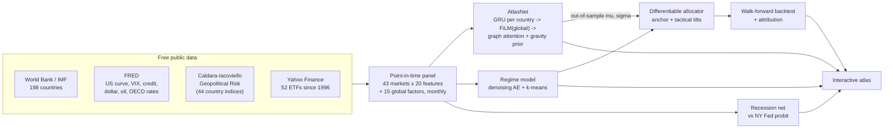

# Global Macro Atlas

**A PyTorch research system that reads the macro and geopolitical state of 198 countries and turns it into one global multi-asset portfolio, then tests whether the deep learning actually helps.**

[](https://github.com/OWNER/global-macro-atlas/actions)
  

**[Open the interactive atlas →](https://OWNER.github.io/global-macro-atlas/)**

<picture>
  <source media="(prefers-color-scheme: dark)" srcset="reports/figures/hero_atlas_dark.png">
  
</picture>

## Results at a glance

Walk-forward, out of sample, February 2010 to September 2026. Total returns in USD after 10 bp transaction costs. The models were retrained every January on data up to the previous December.

| Strategy | CAGR | Volatility | Sharpe | Max drawdown |
|---|---:|---:|---:|---:|
| MSCI ACWI | 10.8% | 14.5% | 0.68 | −25.7% |
| **Strategic anchor (no ML)**: 60% ACWI, 40% defensive mix | **7.9%** | 9.2% | **0.71** | −20.8% |
| Global 60/40 (ACWI / AGG) | 7.5% | 9.4% | 0.67 | −21.3% |
| Momentum top-third (12-1 country rotation) | 7.9% | 15.9% | 0.47 | −35.4% |
| **Atlas allocator** (full deep-learning stack) | 5.8% | 10.5% | 0.45 | −28.6% |
| Risk parity | 4.4% | 6.0% | 0.51 | −15.1% |

**What worked**
* **The recession model.** It was trained on 1962–1999 and never saw 2000 onwards. On that unseen period it ranks the risk of a US recession within 12 months with an **AUC of 0.81**, against **0.63** for the NY Fed-style yield-curve probit. Its probabilities are less well calibrated: the Brier scores are about the same (0.185 against 0.182). Like the yield curve, it also signalled a recession in 2023–24 that never came.
* **The macro regime model.** It recovered the recognisable eras without any labels: the dot-com credit stress, 2008, the QE years, COVID and the 2022 inflation shock.
* **The strategic anchor.** The allocator's own starting point, with no model at all, beat a global 60/40 on Sharpe (0.71 vs 0.67).

**What didn't**
* **Picking countries a month ahead.** Neither AtlasNet (IC −0.010) nor a ridge regression on the same inputs (IC −0.004) had out-of-sample skill. The allocator detected this and cut the country sleeve to 20% of equities, close to its 15% floor.
* **Tactical timing.** The regime-driven equity and defensive tilts *cost* 1.6 percentage points a year against the anchor, and the country tilts cost another 0.5.


That conclusion only holds because the evaluation is strict. Every version of the model is reported, not just the best one (see [Model history](#model-history)).

---

## The dashboard

The site is a static D3 page that works offline and on GitHub Pages. It has seven views:

| View | What you can do |
|---|---|
| **World map** | Colour 198 countries by GDP growth, inflation, debt, current account, fiscal balance, unemployment, income, 10y yield, news-based geopolitical risk, model score or portfolio weight. Scrub through time, re-centre the map on the Atlantic, Pacific or Indian Ocean, and click any country for its dossier. |
| **Portfolio** | Equity curves against six benchmarks, a crisis scorecard covering 10 episodes from the 2011 euro crisis to the 2025 tariff shock, the layer-by-layer attribution, allocation history and current positions. |
| **Macro regimes** | Today's regime, a 15-factor global dashboard, regime probabilities since 1997, and the autoencoder's 2-D "macro map" showing the path of the last 24 months. |
| **Contagion** | AtlasNet's learned attention, which on its own grouped markets into Europe, East Asia, Latin America and the Gulf, alongside a residual-correlation spillover network. Click a country to see where its shocks spread. |
| **Scenario lab** | Eight preset shocks (Middle East war, Fed surprise, China hard landing, Taiwan Strait, euro debt, dollar squeeze, soft landing, tariff war) or custom sliders. Shows the country-by-country impact on the map and on the portfolio. |
| **US rates** | Treasury curve animation from 1990, Nelson-Siegel level, slope and curvature, real yields and breakevens, and recession probability. |
| **How it works** | Architecture, out-of-sample skill by year, feature importance, and the findings above. |

<picture>
  <source media="(prefers-color-scheme: dark)" srcset="reports/figures/hero_scenarios_dark.png">
  
</picture>

## Architecture



**AtlasNet** is a spatio-temporal graph network over 43 equity markets:

```
x[t-11..t, country, 20 features] -> Linear+GELU -> GRU (shared across countries) -> h_i
g[t-11..t, 15 global factors]    -> GRU -> FiLM: h_i <- h_i * (1 + gamma) + beta
graph attention across countries: softmax(QK^T/sqrt(d) + lambda_h * gravity(GDP_i GDP_j / dist_ij^2))
heads: mu_i (expected 3-month relative return), sigma_i (idiosyncratic risk)
loss:  1 - cross-sectional IC  +  0.2 * Gaussian NLL       ensemble of 5 seeds, early stopping
```

* The attention bias comes from the **gravity model of trade**: big, nearby economies start out more connected, and a learned scale per head can override that.
* Training on an **IC loss** asks the network to rank countries rather than fit noisy return levels.
* **Gradient × input** attributions explain every country's score every month. The dashboard shows them as the "Why" bars.

**Regime model.** A denoising autoencoder compresses the 15 global factors into 2-D, and k-means finds five recurring states. Each state is named automatically by matching its factor profile to economic archetypes with Hungarian assignment.

**Allocator.** It is differentiable end to end. Gradients flow from a −Sharpe + drawdown + turnover loss, through a simulated portfolio with partial rebalancing and costs, back into four decisions:

```
equity share   = 0.60 + 0.20 * tanh(w . [regime probs, global factors])     (40-80% band)
equity sleeve  = (1 - s) * ACWI core + s * capped_softmax(a * z(mu) - b * log sigma)   s in [0.15, 0.70]
defensive mix  = softmax(log anchor + W . [regime, factors] + c * momentum)   anchor: Treasuries, TIPS, gold, cash
holdings       = move halfway to target each month (cuts turnover)
```

## A backtest you can trust

* **No look-ahead.** Country features are cross-sectional ranks within each month. Global factors are z-scored on an *expanding* window. Annual macro data for year *Y* is used only from April of *Y+1*. [`test_no_lookahead`](tests/test_data.py) deletes all data after a date and asserts that every earlier feature is unchanged.
* **Two layers of out-of-sample.** AtlasNet forecasts start in 2006. The allocator is trained only on those forecasts, so the reported portfolio (2010 onwards) never sees a prediction that was fitted to its own data.
* **Honest yardsticks.** A ridge regression on the same features and target runs in every fold. The allocator's own anchor, with every model switched off, is reported as a benchmark.
* **Known limitation.** Annual macro data is the latest vintage, so history includes revisions. Market data (prices, yields, VIX, GPR) is not revised.

## Model history

Each version changed one thing for a stated reason. All three are reported, and nothing was tuned on test-period results after v3.

| Version | Change | Reason | CAGR | Sharpe | Turnover |
|---|---|---|---:|---:|---:|
| v1 | Allocate across 43 country ETFs, 12% cap each | Original design | 5.1% | 0.35 | 5.8× |
| v2 | ACWI core plus country satellite; 3-month target; smaller network; partial rebalancing | v1 was structurally underweight the US (ACWI is about 60% US), had no IC and traded too much | 5.0% | 0.39 | 2.3× |
| v3 | Strategic 60/40 anchor with ±20% tactical bands | v2 learned from its 2006–09 training window to sit about 55% defensive for 15 years | **5.8%** | **0.45** | 1.9× |

Each run's results are saved in `results/v1`, `results/v2` and `results/v3`.


## Quickstart

```bash
git clone https://github.com/OWNER/global-macro-atlas && cd global-macro-atlas
./run.sh                 # venv + deps, download data, tests, train, backtest, build the site (~15 min on a laptop CPU)
open docs/index.html
```

```bash
python -m atlas download                 # data only (FRED, IMF/World Bank, GPR, Yahoo)
python -m atlas run --skip-data          # retrain + backtest + export on cached data
python -m atlas run --synthetic --fast   # offline smoke test on a simulated world (what CI runs)
python scripts/attribution.py            # layer-by-layer attribution
python scripts/readme_figures.py         # regenerate README charts from the exported data
pytest -q                                # 14 tests incl. the look-ahead check and model sanity tests
```

## Repository layout

```
atlas/
  universe.py            43 investable markets, ETFs, FRED codes, strategic anchor
  data/                  sources.py (downloaders) · build.py (point-in-time panel) · synthetic.py (test world)
  features/curve.py      Nelson-Siegel decomposition
  models/                atlasnet.py · regime.py · allocator.py · recession.py
  train/walkforward.py   expanding-window training, seed ensembles, ridge baseline, allocator on OOS forecasts
  backtest/engine.py     drifted-weight accounting, costs, benchmarks, crisis scorecard
  scenarios/shocks.py    factor betas + residual spillover network
  explain.py             gradient x input attributions
  export/dashboard.py    one JSON for the site
docs/                    GitHub Pages site (index.html, app.js, vendored d3 + world geometry)
scripts/                 run helpers, attribution, figures, screenshots
tests/                   data, finance, model and end-to-end tests
results/                 metrics for each model version
```

## Data sources

| Source | What | Coverage |
|---|---|---|
| World Bank WDI (IMF WEO when reachable) | GDP growth, inflation, unemployment, government debt, fiscal and current-account balances, GDP per capita, FX reserves | 198 countries, 1990– |
| FRED / OECD MEI | Long and short rates and CPI for OECD and major EMs; the full US Treasury curve, TIPS, breakevens, VIX, Baa spread, NFCI, broad dollar, Brent, NBER recessions | 1962– |
| Caldara & Iacoviello (2022, *AER*) | Geopolitical Risk index built from newspaper text, global plus 44 countries | 1985– |
| Yahoo Finance | Adjusted prices for 43 country ETFs plus SHY, IEF, TLT, TIP, GLD, DBC, UUP, ACWI, AGG | 1996– |

## Next steps

* Collapsing the country-model scores into a few factors (value, momentum, carry) may give a signal that is more stable than country-by-country ranking.
* Push scenario shocks through AtlasNet itself instead of the linear factor model.
* Use real-time vintages of macro data (ALFRED and the WEO archives) to remove revision bias.

*Research project for education. Not investment advice.*
